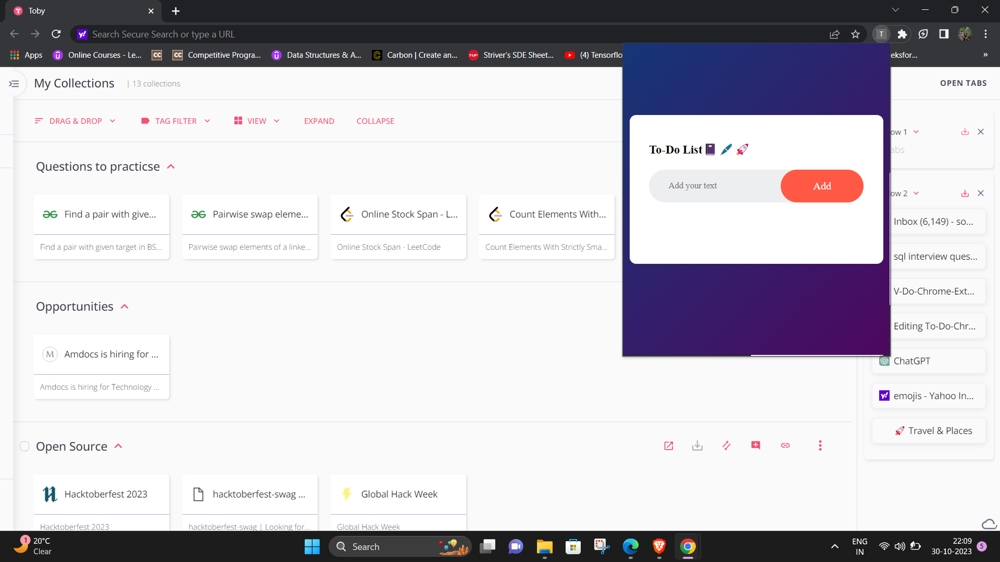
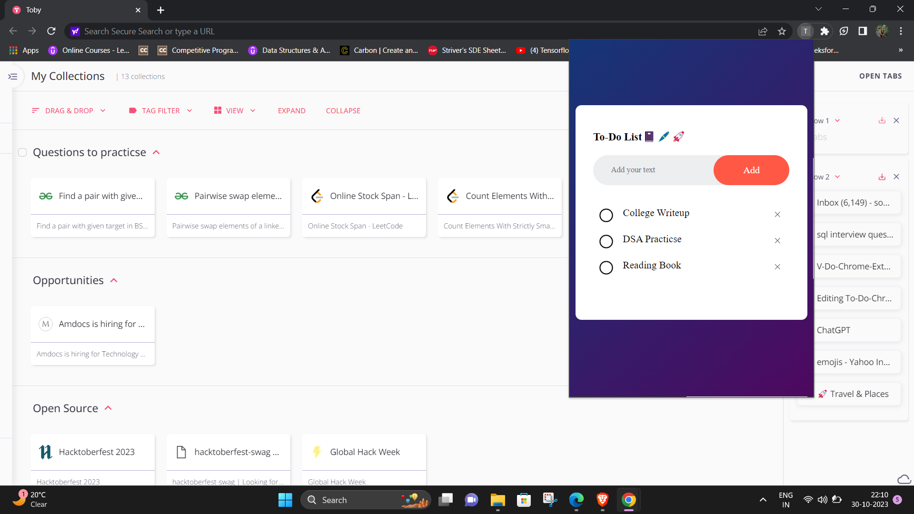

# To-Do-Chrome-Extension

A Chrome extension for task management, that allows you to write down your daily tasks and delete them once they're completed and helping you stay organized and productive.

How to Use the Extension?

First, download the source code and save it on your local machine.
Open your Google Chrome Browser and access the settings.
Head to the extensions section and enable developer mode in Chrome.
Now, click 'Load unpacked' on the left side of the window!
Locate and select the directory where you saved the code!

Tech Stack Used:

HTML5,
CSS3,
JavaScript,
JSON

Glimpse🚀 👀

"
